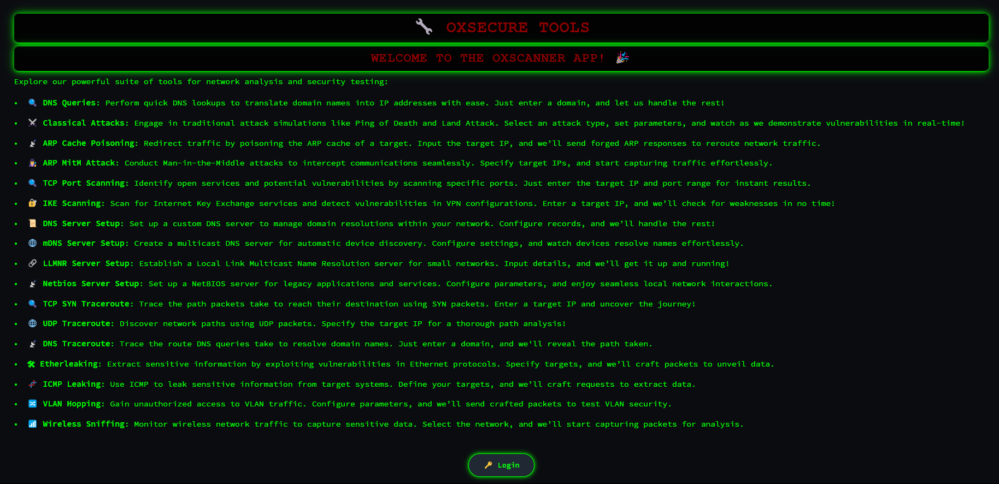
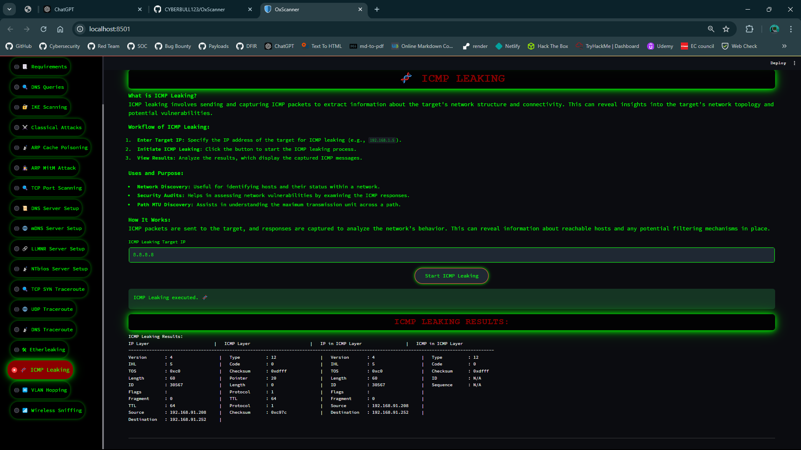

# OxScanner 🚀

**OxScanner** is a cutting-edge cybersecurity tool, part of the **OxSuite**, built with Python and Streamlit. It offers a suite of functionalities including scanning, sniffing, and server setup for security analysis and network troubleshooting. This open-source project is designed for cybersecurity professionals, developers, and enthusiasts, empowering them to enhance their network security skills.

<p align="center">
  
</p>

## Table of Contents 📚

- [Features](#features-✨)
- [Requirements](#requirements-🛠️)
- [Installation](#installation-🥳)
- [Usage](#usage-📖)
- [Contribution](#contribution-🤝)
- [License](#license-📜)
- [Contact](#contact-📫)

---

## Features ✨

<p align="center">
  
</p>

OxScanner provides a wide range of network security and troubleshooting features:

- **Network Scanning**: Identify active hosts, open ports, and services on your network.
- **ARP Spoofing and MitM Attacks**: Perform ARP cache poisoning and man-in-the-middle attacks for penetration testing.
- **DNS and mDNS Server Setup**: Configure DNS, mDNS, LLMNR, and Netbios servers for various networking scenarios.
- **IKE Scanning**: Analyze IKE (Internet Key Exchange) connections in VPN configurations.
- **Wireless Sniffing**: Capture and analyze wireless network packets.
- **Traceroute Capabilities**: Execute TCP SYN, UDP, and DNS traceroutes for network path analysis.
- **Classical Attacks**: Execute a range of classical network attacks for testing.

---

## Requirements 🛠️

Ensure you meet the following requirements before using OxSuite:

- **Python 3.6+**
- **Streamlit**: For creating the web-based interface.
- **Scapy**: For packet manipulation and crafting.
- **Additional Python Libraries**: Install all necessary dependencies with the following command:

  ```bash
  pip install -r requirements.txt
  ```

- **Permissions**: Certain features may require root or administrative permissions. On Linux/macOS, use `sudo`. On Windows, run as Administrator.

---

## Installation 🥳

Get started with OxScanner by following these steps:

1. **Clone the repository**:

   ```bash
   git clone https://github.com/CYBERBULL123/OxScanner.git
   ```

2. **Navigate into the project directory**:

   ```bash
   cd OxScanner
   ```

3. **Install required dependencies**:

   ```bash
   pip install -r requirements.txt
   ```

4. **Run the application**:

   ```bash
   streamlit run oxscanner.py
   ```

5. **Access the application**:

   Open your browser and go to `http://localhost:8501` to interact with OxScanner.

---

## Usage 📖

Once the application is running, you can explore its intuitive interface for a variety of network security operations.

### Example Commands

- **ARP Poisoning**: Enter the client MAC address and gateway IP to initiate ARP poisoning.
- **IKE Scanning**: Input the target IP to scan for IKE vulnerabilities.

<p align="center">
  
</p>

Each section of the app includes clear instructions to guide you through the process of executing network security tasks.

---

## Contribution 🤝

We encourage contributions! If you'd like to help improve OxScanner, please follow these steps:

1. Fork the repository.
2. Create a new branch for your feature (`git checkout -b feature/YourFeature`).
3. Make your changes and commit them (`git commit -m 'Add new feature'`).
4. Push your branch (`git push origin feature/YourFeature`).
5. Open a Pull Request for review.

Please ensure that your code is clean, well-documented, and includes appropriate tests.

---

## License 📜

This project is licensed under the MIT License. For more details, please refer to the [LICENSE](LICENSE) file.

---

## Contact 📫

For any questions or feedback, feel free to reach out:

- **Aditya Pandey** - [📧](mailto:opaadi98@gmail.com)
- **linkedIN**: [Aditya Pandey](https://www.linkedin.com/in/aditya-pandey-896109224)

---

Thank you for exploring OxScanner! We wish you happy hacking! 🔍💻

---
